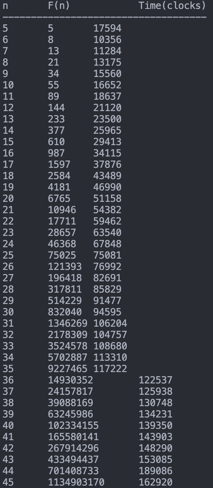

# 검증 및 Big-O 계산식과 프로파일링

유클리드 호제법 `gcd(a, b)`에서 $a=F_n, b=F_{n-1}$일 때:

- $F_n = 1 \cdot F_{n-1} + F_{n-2}$
- 나머지는 $F_{n-2}$가 된다.
- 다음 단계는 `gcd(F_{n-1}, F_{n-2})`가 된다.
  이처럼 나머지가 항상 바로 직전의 피보나치 항이 되므로, 값이 줄어드는 속도가 가장 느리며 단계(step) 수가 $n$에 비례하게 된다.

Big-O 계산식 검토
피보나치 수열의 일반항은 지수 함수 형태($\phi^n$)를 띄므로, $N = F_n \approx \phi^n$ 이라고 할 수 있다.
이때 $n \approx \log_\phi N$ 이 성립하므로, 단계 수 $n$은 입력값 $N$의 로그 값 ($\log N$)에 비례한다.
따라서 $n$이 증가함에 따라 시간이 완만하게 증가하는 도표는 $O(\log N)$ 복잡도를 증명한다.

실행 결과

n F(n) Time(clocks)

---

5 5 17594
6 8 10356
7 13 11284
8 21 13175
9 34 15560
10 55 16652
11 89 18637
12 144 21120
13 233 23500
14 377 25965
15 610 29413
16 987 34115
17 1597 37876
18 2584 43489
19 4181 46990
20 6765 51158
21 10946 54382
22 17711 59462
23 28657 63540
24 46368 67848
25 75025 75081
26 121393 76992
27 196418 82691
28 317811 85829
29 514229 91477
30 832040 94595
31 1346269 106204
32 2178309 104757
33 3524578 108680
34 5702887 113310
35 9227465 117222
36 14930352 122537
37 24157817 125938
38 39088169 130748
39 63245986 134231
40 102334155 139350
41 165580141 143903
42 267914296 148290
43 433494437 153085
44 701408733 189086
45 1134903170 162920
